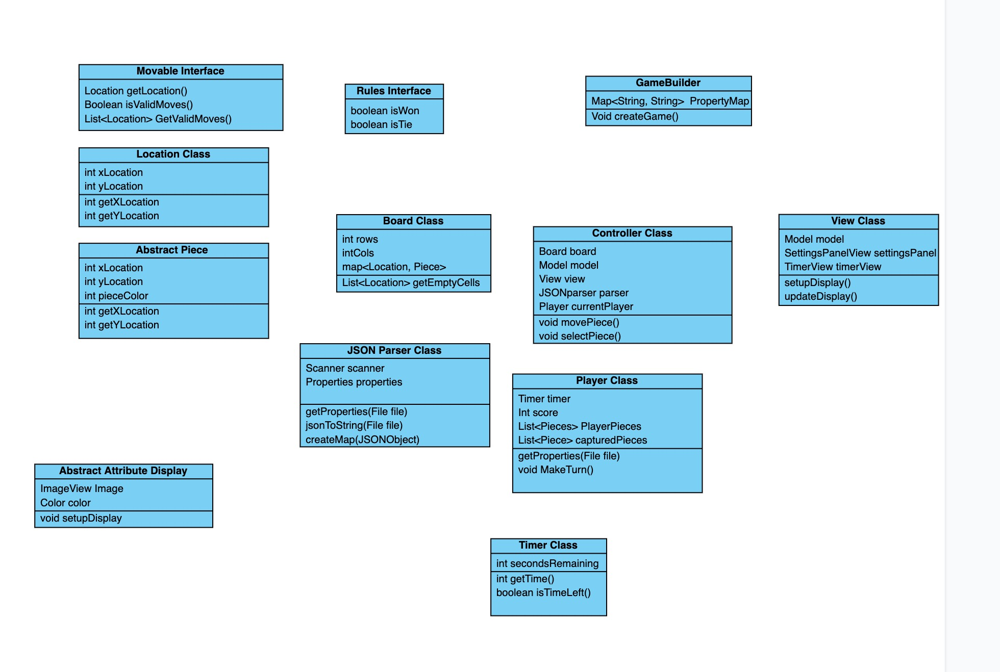

# Design Plan 

## Primary goals and architecture:

Our primary goals for the project are to first and foremost create a chess game that should be flexible enough to support other types of similar board applications. The application should be closed to modification in terms of specific implementations found in subclasses but parent classes should be be open to extension so that other games of similar type can be implemented from our APIs. The board elements of the games are more consistent and will likely vary less from game to game, than the different kinds of pieces will that will handle movement. The APIs will be available to provide reliable interactions between classes that need to communicate across the project, so the model, view, and controller will each have consistent behaviors that are expected and reliable so that we can implement a variety of game types based on chess.  



## APIs Design Overview 


### Controller
* Overview

	* The purpose of this API is to facilitate communication between the model and the view classes. This should hide the complexities of the view from the model, and potentially vice versa. A controller could potentially be used to abstract the complexity of parsing the JSON files and instead could simply provide the view and model with the necessary information. 

* Classes

	* The high level model, view, and parser classes would all interact with the controller. The flow of information that we envision is that the controller would gather the data required by the model and view from the parser, and then the parser would have methods so that the model and view could access this data to be built appropriately. 

* Examples
```java
public class JSONParserController implements Controller

@Override
public void parseFile(String filePath) {
	Map<String, String> dataMap = fileParser.getData();
}

```
* Details

	* This API should serve as a point of communication between the model, view, and the parser. This will allow the classes to remain encapsulated as well as allowing for the configuration of different games and information from data files. As the controller should hopefully be communicative and not dependent on game type we would hope to not need unique controller types for different games, but the changes for different games to instead be handled by configuration files. 

* Considerations

	* The role of a specific controller we had to discuss at length, for example whether its communication should be one way, such as from only model to view, or if the controller should be able to communicate information from model to view as well as view to model. Additionally we envisioned having controllers that communicate information from configuration to model and to view, and others that communicate between model and views only, so thinking about how we would broaden this to an API we found difficult. 

### Engine
* Overview

	* The purpose of this API is to allow developers to interact with the engine. Developers should be able to call the model to get legal moves and update the current board. To add a new functionality, the new class will have to just have to add private methods to change how the given move will affect the rest of the board.
* Classes
	* 
* Examples
```java
public class ChessEngine implements Engine{
	
	@Override
Public void updateBoard(Piece piece){
movePiece(piece);
checkEliminations();	
}
}
```

* Details
	* This API doesn’t communicate to ANY APIs. It only gets called by the controller where it’ll return information back or change the states of the model board. Information will be sent into the engine as a Piece object, which will be the updatedPiece. This will also have the old location of the piece so that we can update the board accordingly. For Connect4, the piece will have a column (the row doesn’t matter because of ‘gravity’ ) and this information will be used to calculate how far down the piece will fall. Since this game will always be adding pieces, the old location doesn’t matter. For checkers and connect four, the old location will be used to find the moved Piece’s location, and then the new Location will be used to move it. During this, we will check for any pieces that get removed.

* Considerations
	* We might need more methods. It’s possible that we will need more methods since the Controller will need to interact with the view in more ways than to just call for an update. For example if we want to look at valid moves in the past/future, there is currently no support for that.

### View
* Overview
	* The purpose of this API is to allow developers to interact with the view. Developers should be able to change what is viewed, the states of the pieces, and what game is being displayed. To add a new functionality, the new class will have to just have to add private methods to change how the updated board will be displayed.
* Classes
	* PieceView, BoardView, 
* Examples
```java
public class ChessView implements View{
	
	@Override
Public void updateDisplay(Board board){
	for (square : board){
		This.board.setSquare(square); 
	}
}
}
```
* Details
	* This API interacts with the Controller API only. It needs the controller to load a new game file, submit a move, and get legal moves from the model. Depending on the game, the inputted board may contain squares with more or less information that needs to be copied to the view Board. This can easily be done by overriding the method to do more setting/getting. For Connect4, updating the board will require a new piece being added to the view. This likely will just change the image from transparent to a color. For checkers and chess, updating the board will require a piece to be moved from A to B, while sometimes also removing a piece.

* Considerations
	* This API might be too simple. It’s possible that we will need more methods since the Controller will need to interact with the view in more ways than to just call for an update. For example, if we are trying to change the game while the program is running, we might need a method to rebuild the view. 
